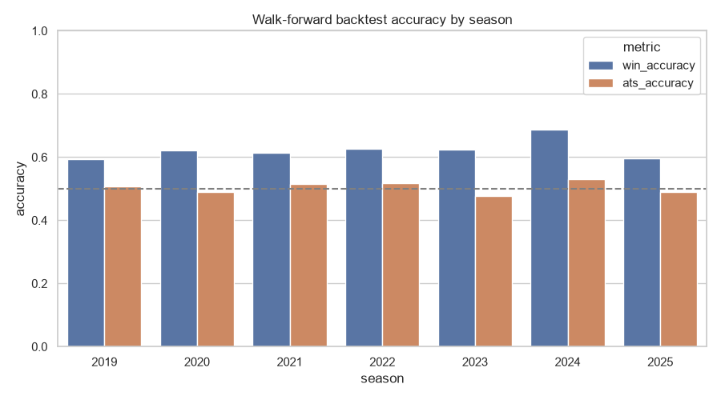
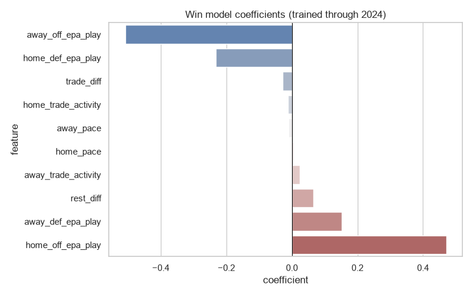

# NFL Game Predictor

**Live site:** https://jonacardiel.github.io/nfl-game-predictor/

A logistic regression model that predicts NFL game outcomes and against-the-spread (ATS) picks, trained on 10 seasons of play-by-play data. A GitHub Action re-runs it every week and pushes the new predictions straight to a live static site — nobody has to touch it.

## How it works

**Features** (all computed using only data available strictly before the game being predicted — no leakage):

- Offensive EPA (expected points added) per play, season-to-date
- Defensive EPA per play allowed, season-to-date
- Pace (offensive plays per game)
- Rest days since each team's last game
- Recent trade activity (trades in the 14 days before kickoff)

Early-season weeks blend toward the prior season's rate (shrinking as more current-season games accumulate), so Week 1 predictions aren't blind.

**Models** (scikit-learn):

| Model | Type | Predicts |
|---|---|---|
| Win model | Logistic regression | Home team win probability |
| ATS model | Logistic regression | Home team cover probability (spread included as a feature) |
| Margin model | Linear regression | Predicted point margin — used to size the live ATS pick against the market spread |

Trained on **2,639 completed regular-season games** across the 2016–2025 seasons, using [`nflreadpy`](https://github.com/nflverse/nflreadpy) for play-by-play, schedule, and trade data.

**Evaluation:** a season-by-season walk-forward backtest — each holdout season is scored using a model trained only on the seasons *before* it, so there's no peeking at the future.

## Results

| Season | Win accuracy | ATS accuracy |
|---|---|---|
| 2019 | 59.4% | 50.8% |
| 2020 | 62.1% | 48.8% |
| 2021 | 61.4% | 51.5% |
| 2022 | 62.7% | 51.7% |
| 2023 | 62.5% | 47.7% |
| 2024 | 68.8% | 53.0% |
| 2025 | 59.6% | 49.1% |

Straight-up win accuracy consistently beats a coin flip. **ATS accuracy sits right at ~50%** across every season — which is the expected, correct result. The closing spread already prices in almost everything a five-feature model can see; beating the market consistently would be the surprising outcome, not this.



The win model's coefficients also check out directionally — better home offense and worse away offense both push the home win probability up, and vice versa for defense and rest:



### A bug worth mentioning

Early in development, the ATS label formula used `-spread_line` instead of `spread_line` — a sign error. It back-tested at **79.5% ATS accuracy**, which should have been an immediate red flag: no simple model beats an efficient betting market by that margin. Tracing the implausible result down to the sign bug (see [`nfl_predictor/labels.py`](nfl_predictor/labels.py)) is what turned a fake result into the honest ~50% above. An unbelievably good number in a well-studied, efficient domain is usually a leak, not a breakthrough.

## Tech stack

Python · pandas · scikit-learn · seaborn/matplotlib (offline evaluation plots) · [`nflreadpy`](https://github.com/nflverse/nflreadpy) · GitHub Actions (scheduled inference) · GitHub Pages (static site, vanilla HTML/CSS/JS, no framework)

## Repo structure

```
nfl_predictor/          Core package
  data.py                 nflreadpy wrappers + parquet caching
  features.py              EPA/pace/rest/trade feature engineering
  labels.py                 win / margin / ATS-cover targets
  model.py                  fit / evaluate / save / load the 3 models
  predict_core.py           shared prediction logic (used by predict.py and export_web.py)
  web.py                    current-week detection + live season scorecard
  report.py                 seaborn plots + console table formatter
train.py                Trains all 3 models on the last 10 completed seasons, backtests, saves artifacts
predict.py               CLI: predictions for one week, printed + saved to CSV
export_web.py            Writes docs/data/*.json for the website
scripts/fetch_logos.py   One-time download of team logos (self-hosted, not hotlinked)
docs/                    The static site (GitHub Pages serves this folder)
models/                  Saved model artifacts + backtest.json (committed — a few KB)
.github/workflows/       predict.yml (weekly, automatic) · train.yml (manual retrain)
```

## Running it locally

```bash
python -m venv .venv
.venv\Scripts\activate       # Windows; use `source .venv/bin/activate` on macOS/Linux
pip install -r requirements.txt

python train.py                              # trains + backtests + saves models/
python predict.py --season 2026 --week 1     # prints a prediction table
python export_web.py                         # writes docs/data/*.json for the site

python -m http.server --directory docs       # then open http://localhost:8000
```

## Automation

- **`predict.yml`** runs every Tuesday (after the week's games are final and new spread lines are posted), regenerates `docs/data/*.json`, and commits it — the live site updates itself.
- **`train.yml`** is manual-only (`workflow_dispatch`), so a scheduled job can never silently swap the deployed model out. Run it once a new season's worth of games is worth training on.
- GitHub disables scheduled workflows after 60 days of repo inactivity (relevant in the NFL offseason) — `train.yml`/`predict.yml` can always be triggered manually from the Actions tab in the meantime.

---

*Educational project, not affiliated with the NFL. Team names/logos are used for identification only. Not betting advice.*
